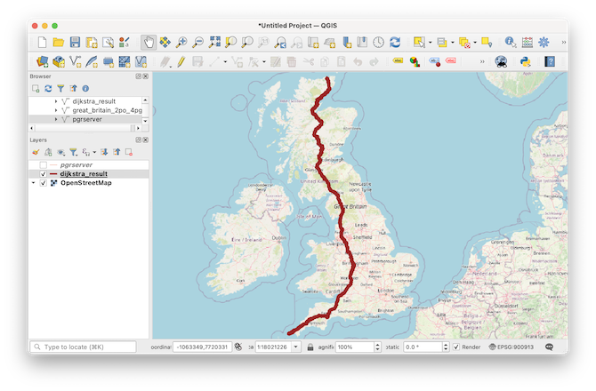

# pgDijkstra-go



pgDijkstra-go is a native Shortest Path Search function for **PostgreSQL** databases. This is written using the Go Language and uses [a very Fast GoLang Dijkstra engine](https://github.com/RyanCarrier/dijkstra) which enables pgDijkstra-go to perform long distance searches even in very dense networks.

## Build and Install

To build and install the function the following has to be done:  

* edit `install.sh` and change the `GO_DB` parameter to point to the correct PostgreSQL database that will be used to install the function. 

* run the `compile.sh` script to create **libPgDijkstra-go.so** library file.

```
./compile.sh
```

* run the `install.sh` to create a SQL  function in the PostgreSQL database that will call the native function in the created library file.

```
./install.sh
CREATE FUNCTION
```

## Usage

By this point, the sample function `pg_dijkstra_go` already has been installed and can now be run.

```
go=# \df pg_dijkstra_go
                             List of functions
 Schema |      Name      | Result data type |  Argument data types   | Type 
--------+----------------+------------------+------------------------+------
 public | pg_dijkstra_go | text             | text, integer, integer | func
(1 row)

```

The pg_dijkstra_go function takes 3 parameters:

1. A **JSON Formatted Text** that contains the Graph Data.
2. The **Source Node ID** of the requested Shortest Path.
3. The **Target Node ID** of the requested Shortetest Path


And the Graph Data in JSON Text format should contain the following data:

* ID of the Edge
* Source Node ID
* Target Node ID
* Cost of the Edge

#### Examples


* Getting a Shortest Path that will return a Text containg the edge ids in `JSON format`:

```sql
select pg_dijkstra_go((select json_agg(graph)::text as graph from (select id,source,target,cost from pgrserver) graph),1209274,1844841);

```

* Transforming the returned JSON Text into a `set of records`

```sql
select * from json_to_recordset( (select pg_dijkstra_go((select json_agg(graph)::text from (select id,source,target,cost from pgrserver) graph),1209274,749290)::json) ) as x (edge_id int) ;
```

* Inserting the results of the Shortest Path Search into a Table:


```sql
insert into dijkstra_result  select id,geom from pgrserver where id in (select edge_id from json_to_recordset( (select pg_dijkstra_go((select json_agg(graph)::text from (select id,source,target,cost from pgrserver) graph),1209274,749290)::json) ) as x (edge_id int));
```